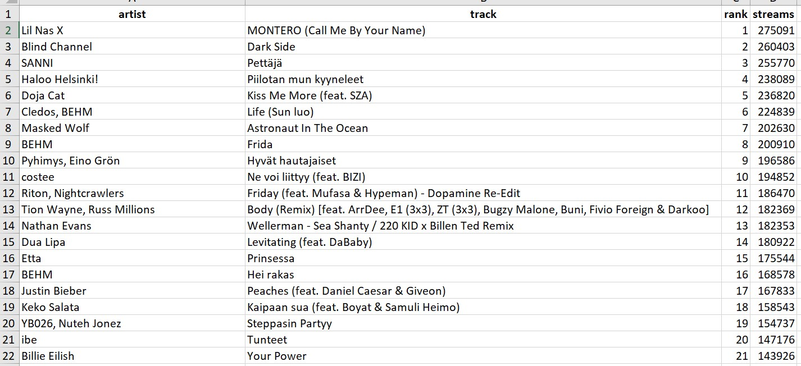

```{r setup, include=FALSE}
knitr::opts_chunk$set(collapse = TRUE)
```

# Intro

I wanted to find out how to mine text from PDF files with R. Last week I tried to extract text from a [PDF file with just text in it](https://youcanbeapirate.com/2021/05/22/mining-text-from-pdf-files-part-1-pdf-with-text/). This week I will try extracting text from a PDF file with a table. Next week, I will try it from a picture inside a PDF file.

I'm assuming you're using RStudio as your IDE (Integrated Development Environment). I'm sure most of this can be done with using something else as well.

# __tabulizer__ in action

For this experiment, I'm using another cool package called [tabulizer](https://cran.r-project.org/web/packages/tabulizer/vignettes/tabulizer.html). If you'd like to know more about it, you should check out the package's documentation.

## 1. Let's get ready

Before we go any further, I'm going to load the packages we'll be needing today:
```{r, warning=FALSE, message=FALSE}
library(tabulizer)
# The main package for this operation

library(tidyverse)
# Prerequisite to everything

library(writexl)
# My go-to package for writing Excel files
```

I'll also show you the raw material. If you'd like to try this at home, you can save the PDF file shown below. What we're looking at here is [(Spotify's weekly top 100 chart for Finland (2021-05-14 - 2021-05-21)](https://spotifycharts.com/regional/fi/weekly/2021-05-14--2021-05-21), but in text form.

{width=100%}

## 2. Read in the PDF file

Next, let's read in the pdf file with the table inside with _extract_tables()_ from the __tabulizer__ package:

```{R}
pdf_with_table <- extract_tables("index_files/pdf_with_table.pdf", method = "decide") # "decide" is the default method here, others are "lattice" and "stream" (see documentation for more info about them, but you can try switching them for a neater outcome, depending on the raw material)
pdf_with_table
```

Okay, looks like we ended up with a _list_ again. Let's next turn it into a _tibble_ by first using _rbind_ to combine the list into a matrix.

## 3. Turn the _list_ into a _matrix_ and then to a _tibble_

First, using the _do.call()_ function, let's tell R to use _rbind()_ to combine the rows of the two elements inside that list _pdf_with_table_. Then, using the pipe operator (%>%), one of my favorite things about Tidyverse, let's feed the _as_tibble()_ function to create a tibble.

```{R, warning=FALSE}
pdf_with_table_tbl <- do.call(rbind, pdf_with_table) %>% 
  
  as_tibble()

pdf_with_table_tbl
```

Now, that looks better already, but we still need to turn the first row into column names. Let's use a new package for that.

## 4. Turn first row into columns with __janitor__

[Janitor](https://cran.r-project.org/web/packages/janitor/vignettes/janitor.html) is a nice little package to help clean data with. We'll be using its _row_to_names()_ function. And since we only need it this once, we might as well call it writing 'package::function()' instead of library(package) and function() separately.

```{R}
pdf_with_table_named_tbl <- pdf_with_table_tbl %>%
  
  janitor::row_to_names(row_number = 1)

pdf_with_table_named_tbl
```
Nice! We're almost there. Now we'll just change the column types for rank and streams.

## 5. _Mutate_ rank and streams to _numeric_

Let's now _mutate_ the two numeric columns from character type to _numeric_.

```{R}
pdf_with_table_final_tbl <- pdf_with_table_named_tbl %>%
  mutate(
    rank    = as.numeric(rank),
    streams = as.numeric(streams)
  )

pdf_with_table_final_tbl
```

That's it! Now we just need to create the excel file again.

## 6. Create Excel file with __writexl__

```{R}
write_xlsx(pdf_with_table_final_tbl, "index_files/excel_from_table.xlsx")
# You should change the file path to suit your needs
```



# Outro

We took a different path, because of the slightly different starting point. But we ended up with the same end results as last week. So, if you have tabular data inside a PDF, __tabulizer__ is definitely worth checking out! 

Thanks for reading this far. If you're curious to see, how the same data behaves if it's in picture inside a PDF (like a matryoshka doll), tune in next week for part 3 of this PDF trilogy! Until then, happy text mining!

ps. I'm more than happy to chat about all things data. Just send me a message on LinkedIn if you wish to do so!