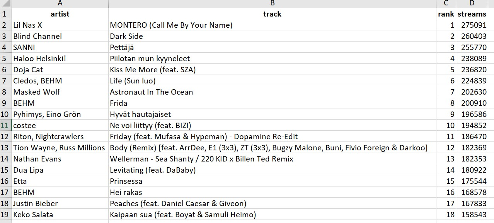

```{r setup, include=FALSE}
knitr::opts_chunk$set(collapse = TRUE)
```

# Intro

I wanted to find out how to mine text from PDF files with R. I'm experimenting with different formats, the previous ones having been text and tables. In this last one I will extract text that's in an image that's inside a PDF file.

I'm assuming you're using RStudio as your IDE (Integrated Development Environment). I'm sure most of this can be done with using something else as well.

# __tesseract__ and __magick__ in action

For this last PDF experiment, I'm using this awesome package called [tesseract](https://cran.r-project.org/web/packages/tesseract/vignettes/intro.html). It's a powerful _optical character recognition (OCR)_ engine that supports over 100 languages. Still, a disclaimer is in order. According to the package documentation:

> Keep in mind that OCR (pattern recognition in general) is a very difficult problem for computers. Results will rarely be perfect and the accuracy rapidly decreases with the quality of the input image. But if you can get your input images to reasonable quality, Tesseract can often help to extract most of the text from the image.

In order to get the most out of __tesseract__, we'll also be trying out another cool package called [magick](https://cran.r-project.org/web/packages/magick/vignettes/intro.html). It has a lot of powerful features beyond our scope today and if you're interested in image prosessing in general, it's definitely worth checking out.

## 1. Let's get ready

Before we go any further, I'm going to load the packages we'll be needing today:
```{r, warning=FALSE, message=FALSE}
library(tesseract)
# The main package for this operation

library(magick)
# Used for image pre-processing when needed

library(pdftools)
# Not the main 'character' today, but we still need this one in the first example

library(tidyverse)
# Prerequisite to everything

library(writexl)
# My go-to package for writing Excel files
```

I'll also show you the raw material. If you'd like to try this at home, you can save the PDF file shown below. What we're looking at here is [(Spotify's weekly top 100 chart for Finland (2021-05-14 - 2021-05-21)](https://spotifycharts.com/regional/fi/weekly/2021-05-14--2021-05-21), as it is on the web page. I will be using a sample of the first 18 tracks.

Immediately we can detect some potential trouble ahead with this one. There's a lot of unnecessary information (the thumbnails, the markers showing whether the song has gone up or down on the list etc.) and the text for artist names and streams is very faint (at least compared to the track names).

{width=100%}

## 2. Read in the PDF file with __pdftools__

To begin, let's read in the pdf file using __pdftools__:

```{R}
pdf_with_image_1 <- "index_files/pdf_with_image_1.pdf"
png_with_image_1 <- pdf_convert(pdf_with_image_1, dpi = 600, format = "png")
```

## 3. 'Read' the image with __tesseract__

Let's see what our baseline is without any pre-prepping.

```{R}
eng <- tesseract("eng")
text_from_image_1 <- ocr(png_with_image_1, engine = eng)
cat(text_from_image_1)
```
Okay, not exactly what we would've hoped to see, but not as bad as I feared. 15 out of 18 track names are there and parts of the artist names as well. But a lot of extra noise too. Let's take care of that first.

Let's see what we can do with a slightly cropped version of the same image.

## 4. Crop the image with __magick__

First, we need to know the width of the original image to know what we're working with here.

At this point, we're going to leave __pdftools__ behind and use only __magick__ (and __tesseract__ after the pre-processing is done).

So, let's read in the pdf with _image_read_pdf()_ and look at the metadata:

```{R}
png_1 <- image_read_pdf("index_files/pdf_with_image_1.pdf")

print(png_1)
```

We can see that the image's width is 3300 (pixels). At the moment that's the only piece of information we're interested in.

So, what if we take away some amount of pixels from the left, so that we're left with just the text elements.

(Just like in all the cooking shows on TV, I've omitted the part where I tested with different widths to come up with the one that I was happy with.)

But now that we know that we want to crop away 700 pixels from the left, we just have to insert the _target width_ (2600) x _target height_ (2550) + _crop position from the left_ (700) to _image_crop()_:

```{R}
png_2 <- png_1 %>% image_crop("2600x2550+700")

print(png_2)
```

Nice and tidy cropping, isn't it! What do you think, did that help with the actual text mining? Only one way to find out!

## 5. 'Read' the cropped image with __tesseract__

```{R}
# eng <- tesseract("eng") <-- we don't need to run this again
text_from_image_2 <- ocr(png_2, engine = eng)
cat(text_from_image_2)
```

Interesting! As the Finnish saying goes, "That doesn't take us to the moon, yet". But we did get rid of the extra noise. A crucial first step.

However, now only 14 out of 18 track names are correct. So we lost one track name in the process. Let's not worry too much about that at the moment, though. 

I do wonder if we could do some more __magick__ tricks with the image and see if that helps at all with the recognition.

We'll be using some of the methods mentioned in the documentation for [__Tesseract__](https://tesseract-ocr.github.io/tessdoc/ImproveQuality.html) (the algorithm, not the R package with a lower case r).

## 6. Use __magick__ to make the image more machine friendly

The first thing to try out is to make a negative version of the image. Why? Because I'm thinking that the grey text would perhaps be easier to distinguish from a white background than from a black one.

```{R}
# Negating the image
png_2_negated <- png_2 %>% 
  image_negate()

# Using that negated image to 'read' the text
png_2_negated %>%
  ocr(engine = eng) %>%
  cat()

# Printing out the negated image
png_2_negated
```

A great start! That one thing lead to us having all of the track names there. Let's then convert the image to Grayscale to see if we could get more information out of it:

```{R}
# Grayscaling the image
png_2_grayscale <- png_2_negated %>% 
  image_convert(type = "Grayscale")

# Using that grayscaled image to 'read' the text
png_2_grayscale %>%
  ocr(engine = eng) %>%
  cat()

# Printing out the grayscaled image
png_2_grayscale
```

Some conflicting results there. _Grayscaling_ helped with some rows, but hindered with others. Let's keep going and see if additional image transformations will be of use.

How about _resizing_? (__CAUTION!__ Making the image too large will take a long while for the computer to process. Why do I know that? I'm sure you can guess the reason...):

```{R}
# Resizing the image
png_2_resized <- png_2_grayscale %>% 
  image_resize("4000x")

# Using that resized image to 'read' the text
png_2_resized %>%
  ocr(engine = eng) %>%
  cat()

# Printing out the resized image
png_2_resized
```

Next up, _trimming_ the margins.

```{R}
# Trimming the image
png_2_trimmed <- png_2_resized %>% 
  image_trim(fuzz = 80)

# The fuzz parameter allows for the fill to cross for adjacent pixels with similarish colors. Its value must be between 0 and 256^2 specifying the max geometric distance between colors to be considered equal.

# Using that trimmed image to 'read' the text
png_2_trimmed %>%
  ocr(engine = eng) %>%
  cat()

# Printing out the trimmed image
png_2_trimmed
```

Wow! Just by removing the extra margins, we were able to get most of the data to appear. One interesting thing to try would be to see whether you could just use that _image_trim()_ alone and reach the same place without all the other steps. I suggest you try that!

Also, I could spend more time analysing the different combinations of the steps we've tried so far and some steps we have yet to try. However, to be able to release this blog post, I must stop somewhere.

So, for now, this will do. The improvement from the beginning to here is really impressive! So, let's finish this by doing some cleanup.

## 7. Create a _character vector_, split it into a _list_ and then convert it to a _tibble_

```{R}
# Use tesseract to make a character vector and then split it into a list
png_2_list <- png_2_trimmed %>%
  ocr(engine = eng) %>%
  strsplit(split = "\n")

# Unlist that list and convert it to a tibble  
png_2_tbl <- as_tibble(unlist(png_2_list))

png_2_tbl
```

From here it's pretty straightforward to get to the cleaned excel file. We will have to make some adjustments that are quite manual, so this wouldn't do if we had a bunch of these files to extract text from.

Still, cleaning up the data does have some interesting steps and is always good practice, so, without further ado, let's do this!

## 8. Remove first row and add the missing value manually to empty row

We won't be needing that "TRACK STREAMS (?" text, so let's get rid of it with _slice()_. Also, for the next steps involving regex to work, we need to insert the missing value and we'll insert it on row 14 that is conveniently empty.

```{R}
png_2_filtered_tbl <- png_2_tbl %>%
  slice(-1) # Note to self and others: slice(n) to keep the nth row, slice(-n) to get rid of it
  
png_2_filtered_tbl[14, 1] <- " 182,369" # that empty character in front of the value is there on purpose... it will come in handy later with regex

png_2_filtered_tbl
```

## 9. Merge rows with the help of __unpivotr__

In the previous post we used janitor to help with the data cleanup. This time we'll use another nice little package called [unpivotr](https://cran.r-project.org/web/packages/unpivotr/vignettes/introduction.html).

And again, since we only need it this once, we might as well call it writing ‘package::function()’ instead of library(package) and function() separately.

```{R}
png_2_merged_tbl <- unpivotr::merge_rows(
  unpivotr::as_cells(png_2_filtered_tbl), 
  rows = 12:14, 
  chr) %>% 
  arrange(row) %>% # arrange is needed to get the rows in right order for later
  select(chr) # after merge_rows and as_cells we need this select, otherwise there would be three other columns to worry about

png_2_merged_tbl
```

Alright, now for the fun part, our old pal _regex_.

## 10. Split the data into 3 columns using _regex_ and __tidyr__'s _extract()_

We choose the column (_chr_) we want to split up, then tell _extract()_ the target column names, then the regex part, which is basically saying that let's put everything before the word by to the first column _([^:]+)_, let's put everything after the word _by_ to the second columnn _([^-]+)_, but any two groups of numbers (that have _,_ or _._ in the middle) that are at the end of the row, should be put to the third column _(\\d+.[,.].\\d+$)_. 

And yes, those empty characters matter. Without them, the cells would have those empty characters before or after the values we want.

```{R}
png_2_regex_tbl <- extract(png_2_merged_tbl,  
                           chr, 
                           into = c('track', 'artist', 'streams'),
                           '([^:]+) by ([^-]+) (\\d+.[,.].\\d+$)', 
                           convert = TRUE)

png_2_regex_tbl
```

Almost there! Time for the final cleanup with some __tidyverse__ magic!

## 11. Final cleanup with __tidyverse__ goodness

I won't go through everything in detail, but in the next chunk of code, we first clean up the _streams_ column and make it _numeric_. 

Then we use _case_when()_ (such a great function!) to correct any spelling mistakes left.

We add the _rank_ column and populate it with _row_number()_ (that's why we needed to use _arrange()_ earlier).

And finally, we use select to order the columns nicely.

```{R}
png_2_final_tbl <- png_2_regex_tbl %>%
  
  mutate(
    
    streams = png_2_regex_tbl$streams %>% 
      str_remove_all(pattern = regex("[ ., ]")) %>% as.numeric(),
    
    track = case_when(
      track == "Pettaja" ~ "Pettäjä",
      track == "Hyvat hautajaiset" ~ "Hyvät hautajaiset",
      TRUE ~ track),
    
    artist = case_when(
      artist == "Li! Nas x" ~ "Lil Nas X",
      artist == "Blind Channe!" ~ "Blind Channel",
      artist == "SANN|" ~ "SANNI",
      artist == "\\Viasked VVolf" ~ "Masked Wolf",
      artist == "Pyhimys, Eino Grén" ~ "Pyhimys, Eino Grön",
      artist == "Riton, Nightcrawilers" ~ "Riton, Nightcrawlers",
      artist == "BEH!V/" ~ "BEHM",
      artist == "Keko Salate" ~ "Keko Salata",
      str_detect(artist, "Tion Wayne") ~ "Tion Wayne, Russ Millions",
      TRUE ~ artist),
    
    rank = row_number()
  
    ) %>% 
  
  select(artist, track, rank, streams)

png_2_final_tbl
```

Now all that's left to do is to write the excel file.

## 12. Create Excel file with __writexl__

```{R}
write_xlsx(png_2_final_tbl, "index_files/excel_from_pdf_with_image_2.xlsx")
# You should change the file path to suit your needs
```



# Conclusion

I can't help but go back to the quote we started this journey with:

> Keep in mind that OCR (pattern recognition in general) is a very difficult problem for computers. Results will rarely be perfect and the accuracy rapidly decreases with the quality of the input image. But if you can get your input images to reasonable quality, Tesseract can often help to extract most of the text from the image.

I feel like everything that was said in that quote was realised during this experiment. And even if I had to use some manual data cleaning to get to the final excel file, I'm still super impressed by both __tesseract__ and __magick__. This was the first time using them both and we still got pretty far!

Now it's time to end this mini-trilogy. Let's see what I come up with next. It might be another test run with a cool package I want to learn to use or it might be more generally about my learning journey. 

If you've read this far, thanks for your time and interest! If you have any questions or comments, don't hesitate to contact me on LinkedIn (since I still haven't managed to add the Disqus module for comments, but I'm working on it)!