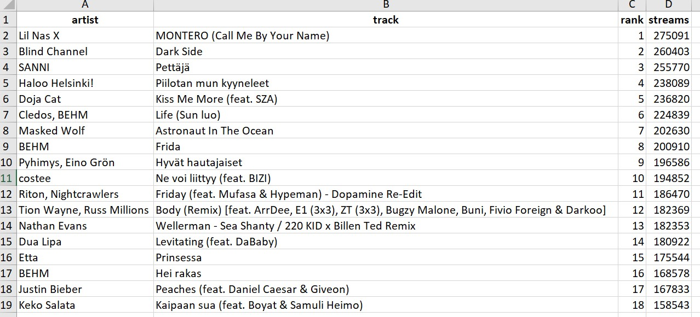

```{r setup, include=FALSE}
knitr::opts_chunk$set(collapse = TRUE)
```

# Intro

A colleague of mine asked whether I had a way to anonymize distribution data that we can get from Teosto's web service. Since the data contains a lot of sensitive information, something needs to be done in order to protect the privacy of everyone involved, if we want to demonstrate it to a customer or a stakeholder.

Also, not that long ago, I happened to see this [blog post](https://towardsdatascience.com/how-to-create-fake-data-with-faker-a835e5b7a9d9) by __Khuyen Tran__ (_Data Science Simplified_) about creating fake data in Python. I thought there must be something similar in R and sure enough, I found various different methods to achieve what the blog post talks about.

I'm assuming you're using RStudio as your IDE (Integrated Development Environment). I'm sure most of this can be done with using something else as well.

# __fakeR__, __charlatan__ and __rcorpora__ in action

We'll be using three main packages. First one is called [fakeR](https://cran.r-project.org/web/packages/fakeR/vignettes/my-vignette.html):

> 
The package allows for simulating datasets of various variable types. This includes datasets containing categorical and quantitative variables as well as datasets of clustered time series observations. The package functions are also useful for maintaining a similar structure of missingness if one is to exist in the existing dataset.

So, despite the similar name - __fakeR__ vs. __Faker__ - this package isn't actually for creating fake data. For that, we have [charlatan](https://github.com/ropensci/charlatan) that is actually inspired by and borrowing from Python's __Faker__.

The third package, [rcorpora](https://github.com/gaborcsardi/rcorpora) is a collection of small corpuses. And while they weren't necessarily created for the purpose that we will be using them, getting a little creative doesn't hurt. As you will see, some of the solutions might not be suitable for actual production use, but this post works, hopefully, as an inspiration to get started. So, with that, let's get started!

## 1. Let's get ready, part 1

Before we go any further, I'm going to load the other packages we'll be needing today (for clarity's sake, I'm loading the main packages when they are first needed):

```{r, warning=FALSE, message=FALSE}
library(tidyverse)
# Prerequisite to everything

library(writexl)
# My go-to package for writing Excel files

library(readxl)
# My go-to package for reading Excel files
```

Before getting to the 'main course', let's start with something familiar (for those of you who have read the [previous blog posts](https://youcanbeapirate.com/2021/06/05/mining-text-from-pdf-files-part-3-pdf-with-an-image/) about mining text from PDFs) as a way to introduce you to [fakeR](https://cran.r-project.org/web/packages/fakeR/vignettes/my-vignette.html).

For that, we need to read in the Excel file that was created last time:
{width=100%}

We'll read in the excel file. Notice that for __fakeR__ to work, it's important that we create a _data frame_ and not a _tibble_ (you can read about the differences between the two in [here](https://cran.r-project.org/web/packages/tibble/vignettes/tibble.html))!

```{R}
excel_from_pdf <- 
  read_xlsx("index_files/excel_from_pdf_with_image_2.xlsx") %>% 
  as.data.frame() # Because of fakeR, we'll be using data frames today.
```

And since _factor_ isn't a possible _col_type_ for _read_xlsx()_ to define, let's go ahead and _mutate()_ the __rank__ column instead.

```{R}
excel_from_pdf <- excel_from_pdf %>%
  mutate(rank = rank %>% as_factor())
```

```{R}
str(excel_from_pdf)
```

```{R}
excel_from_pdf
```

## 2. Simulate data with __fakeR__

__fakeR__ will, in essence, use the existing data to come up with new data. What we want to do, at this point, is to keep the __artist__ and __track__ data as they are. We just want to scramble the __streams__ and then re-create the __rank__ data according to the new descending order of streams.

One interesting argument for _simulate_dataset()_ is _stealth.level_. Here's what the documentation has to say about it:

> 
When set to 1 (default), takes into account the covariances between all the unordered factors and the covariances between the numeric and ordered factors. When set to 2, simulates each variable independently. When set to 3, does not take into account any covariances and instead randomly samples from a uniform distribution ranging from the min to the max of the data for each variable.

For this exercise, I decided to go with _stealth.level_ = 3, because I wanted to limit the range of the new values between min and max of the original data.

```{R}
library(fakeR)

sim_excel_from_pdf <- simulate_dataset(excel_from_pdf,
                                       # With ignore, we can decide which columns will be untouched by the simulation.
                                       ignore = c("artist", 
                                                  "rank", 
                                                  "track"),
                                       stealth.level = 3) %>%
    
    # Let's arrange the rows according to the streams (descending)
    arrange(desc(streams)) %>% 
    
    # And then add new values to rank, by using row_number()
    mutate(rank = row_number() %>% as_factor()) %>%
    
    # Let's use select to put the columns back in the original order
    select(artist, track, rank, streams)

write_xlsx(sim_excel_from_pdf, "index_files/sim_excel.xlsx")
```

Here's a picture from the simulated data, back in Excel:
{width=100%}

By the way, the green triangles on __rank__ values come from the fact that excel doesn't recognise the _factor_ data type, which is good to keep in mind.

You should also note that that picture is essentially a snapshot of one simulation. The stream amounts will differ from those that you see elsewhere on the post.

Now, for easier comparison between original and simulated data, here are summaries of __streams__ from both:

```{R}
# Original
summary(excel_from_pdf$streams)

# Simulation
summary(sim_excel_from_pdf$streams)
```

As you can see, they quite closely resemble each other's range etc. (thanks to that argument _stealth.level_ = 3), but are not exactly same. This can be a good thing, if the idea is to show your 'audience' what type of values are possible. But if that already gives away too much information, you are probably better off with something even more random.

Okay, that's some __fakeR__ to start with. Let's now move to the main exercise. We'll come back to this package a bit later.

## 3. Let's get ready, part 2

I thought it would be interesting for us to use some actual distribution data from [Teosto](https://www.teosto.fi/en/), my employer and the Finnish PRO (Performance Rights Organization). In a nutshell, the data tells what Teosto has payed me in June 2019 for songs that were performed in 2017 and 2018 + some additional information.

Normally, I wouldn't be able to show the original data due to its sensitive nature. But, since I happen to be a songwriter myself and a Teosto member, I can share my own data with you. That way, we can go through the process of anonymizing all of the data and you'll be able to compare the end result with the original.

Here are some of the columns (there are 25 in total) of the original file:
{width=100%}

I don't wish to use the original column names, because they are not very R-friendly, so let's create this vector to replace them with:

```{R}
col_names <- c("work_number", 
               "work_title", 
               "distribution_source", 
               "distribution_id", 
               "distribution_name", 
               "distribution_date",
               "rightsholder_ipi_number",
               "rightsholder_name",
               "rightsholder_role",
               "rightsholder_share_pct",
               "distribution_category_1",
               "distribution_category_2",
               "distribution_category_3",
               "original_name_of_service_or_provider",
               "programme_name",
               "venue_name",
               "performer_name",
               "performance_date_start",
               "performance_date_end",
               "performance_country",
               "iswc_code",
               "isrc_code",
               "type_of_right",
               "quantity",
               "amount_eur")
```

Next, let's read in the csv-file that I've downloaded from Teosto web service. We'll be using _read_csv()_ and I've defined the column types with the handy _col_types_ argument (where each character represents one column):

> 
* c = character
* i = integer
* n = number
* d = double
* l = logical
* f = factor
* D = date
* T = date time
* t = time
* ? = guess
* _ or - = skip

Let's also use that _col_names_ vector from before to define the column names.

```{R}
distribution_csv <- read_csv(
  "index_files/Rask_Antti_Lennart_2019-04-16_2019-06-30.csv",
  col_types = "icfifDicf?fffcccfDDfccfi?",
  col_names = col_names,
  
  # Skip the first row with the titles on it:
  skip = 1) %>% 
  
  as.data.frame() # Because of fakeR, we'll be using data frames today.
```

This is what the data looks just after having been read in:

```{R}
head(distribution_csv)
```

Lots of columns there. Some of them seem to have the same information throughout:

> 
* distribution_source
* distribution_id
* distribution_name
* distribution_date
* original_name_of_service_or_provider
* programme name
* performance_country
* isrc_code
* type_of_right
* quantity

Let's get rid of them for now with the negative _select()_, so that it's easier to focus on the ones that we'll be taking care of today. We know that if we wish to use them later, we can always find them from the original data frame _distribution_csv_ (although we probably won't in this exercise).

```{R}
distribution_2_csv <- distribution_csv %>%
  
  select(
    -c(
      distribution_source, 
      distribution_id, 
      distribution_name,
      distribution_date,
      original_name_of_service_or_provider, 
      programme_name, 
      performance_country, 
      isrc_code, 
      type_of_right, 
      quantity
      )
    )
```

As you can see, it's now much easier to wrap your head around it. 

```{R}
head(distribution_2_csv)
```

Once that's done, we can concentrate on the first anonymization.

## 4. Create fake people names with __charlatan__

You could use [charlatan](https://github.com/ropensci/charlatan) to create fake data for these (and more to come):

> 
* person names
* jobs
* phone numbers
* colors: names, hex, rgb
* credit cards
* DOIs
* numbers in range and from distributions
* gene sequences
* geographic coordinates
* emails
* URIs, URLs, and their parts
* IP addresses

For today's exercise, we'll only be creating person names, though. We first need to create an _environment_ with _fraudster()_ (you can read more about _environments_ [here](http://adv-r.had.co.nz/Environments.html)) and then use _mutate()_ to replace the original __rightsholder_name__ (my name, that is) with a fake one.

```{R}
library(charlatan)

charlatan <- fraudster() # This creates the environment to be used later

distribution_3_csv <- distribution_2_csv %>%
  
  mutate(rightsholder_name = charlatan$name())
```

```{R}
# Original
head(distribution_csv$rightsholder_name)

# Fake
head(distribution_3_csv$rightsholder_name)
```

Nice! Such an easy way to create fake names. In the follow-up blog post we will create a localized fake name generator (for Finnish names) as a possible replacement for this one.

## 5. Using __tidyverse__ and __base R__ to create some fake numbers

Part of the anonymizing can be done with the everyday tools.

It's no surprise that I'm a big fan of [tidyverse](https://www.tidyverse.org/). If you are studying R, you are probably familiar with it, but if not, it's a collection of packages that make it easier to clean and analyse data in R.

The core packages (as of __tidyverse__ 1.3.0). Click the name for a cheat sheet:

> 
* [dplyr](https://github.com/rstudio/cheatsheets/raw/master/data-transformation.pdf) - for data manipulation
* [forcats](https://github.com/rstudio/cheatsheets/raw/master/factors.pdf) - for working with factors
* [ggplot2](https://github.com/rstudio/cheatsheets/raw/master/data-visualization-2.1.pdf) - for creating graphics
* [purrr](https://github.com/rstudio/cheatsheets/raw/master/purrr.pdf) - for working with functions and vectors
* [readr/tidyr](https://github.com/rstudio/cheatsheets/raw/master/data-import.pdf) - for reading rectangular data/for tidying data
* [stringr](https://github.com/rstudio/cheatsheets/raw/master/strings.pdf) -  for working with strings
* tibble - for replacing the data frame

In this exercise we have been and will be using mostly __dplyr__ and __stringr__, but let's not forget that the base R has some very useful functions, like _sample()_.

First, let's _sample()_ the __rightsholder_ipi_number__ (IPI = Interested Parties Information). We would like the numbers to resemble the real numbers and that is why we use _min()_ and _max()_ of the original values to give a believable range to sample from.

Let's then do the same for __work_number__. The next two things we could do in a separate _mutate()_, but while we're at it, let's remove the leading "T" from __iswc_code__ (ISWC = International Standard musical Work Code), so that it can be handled as a numeric value in the next step of the exercise. 

As a bonus, let's correct the __rightsholder_share_pct__, because it went a bit wonky during the import.

```{R}
distribution_4_csv <- distribution_3_csv %>%
  
  mutate(
    
    rightsholder_ipi_number = sample(
      min(rightsholder_ipi_number):max(rightsholder_ipi_number),
      size = nrow(.),
      replace = FALSE),
    
    work_number = sample(
      min(work_number):max(work_number),
      size = nrow(.), 
      replace = FALSE),
    
    # With a little bit of regex, we'll remove the leading "T" from ISWC code, so that we can later work with it as a numeric value.
    iswc_code = str_remove_all(iswc_code, "^T"),
    
    # A simple division will give us a correct rightsholder share percentage. 8,33 became 833 and 25,0 became 250 etc. in the import, so we need to take that into consideration in this mutate().
    rightsholder_share_pct = ifelse(
      rightsholder_share_pct == 250,
      rightsholder_share_pct / 10,
      rightsholder_share_pct / 100),
    
    rightsholder_share_pct = as.character(
      str_replace_all(
        rightsholder_share_pct,
        "\\.",
        "\\,"))
    )
```

We can now also pick __iswc_code__ as a separate vector to be used later for finding the _min_ and _max_ values for it.

```{R}
iswc_code <- distribution_4_csv$iswc_code
```

And this is what the latest changes look like, compared to the original:

```{R}
# Original
head(distribution_csv) %>% 
  
  select(
    rightsholder_share_pct,
    rightsholder_ipi_number,
    work_number,
    iswc_code
  )

```

```{R}
# Fake and/or corrected
head(distribution_4_csv) %>% 
  
  select(
    rightsholder_share_pct,
    rightsholder_ipi_number,
    work_number,
    iswc_code
    )

```

Now, let's get to randomizing the __iswc_code__.

First, we'll use _str_replace()_ from __stringr__ inside a _mutate()_ to replace all the non-empty cells (that's what the bit of regex "^(?!\\\\s*$).+" is for) with a new sampled value. Again we're using the _min_ and _max_ of the original values to make the new values feel more 'real'.

```{R}
distribution_5_csv <- distribution_4_csv %>%
  
  mutate(
    iswc_code = 
      str_replace(
        iswc_code,
        "^(?!\\s*$).+",
        replacement = as.character(
          sample(
            min(iswc_code, na.rm = TRUE):max(iswc_code, na.rm = TRUE),
            size = nrow(.),
            replace = FALSE)))
  )

```

Then we need to return the leading "T" to __iswc_code__ to match the original. Now, if we only used _str_glue()_ (again, from the __stringr__ package), the cells containing _NA_ would also get the leading "T". And we don't want that.

Enter _ifelse()_. If the cell contains _NA_, replace it with _NA_ (so basically, do nothing). Otherwise add the leading "T" to the cell.

```{R}
distribution_5_csv$iswc_code <- ifelse(
  is.na(distribution_5_csv$iswc_code),
  NA,
  str_glue("T{distribution_5_csv$iswc_code}")
  )
```

We can now compare the sampled ISWC codes with the original ones. This way, we have retained the ratio of _NAs_ of the original.

```{R}
# Original
head(distribution_csv$iswc_code)
```

```{R}
# Fake
head(distribution_5_csv$iswc_code)
```

Looks convincing!

If we wanted, we could fade it by skipping the _str_replace()_ altogether and using the same methods that we did for IPI and work numbers. Then we would have no need for the _ifelse()_ either, just the _str_glue()_ part would do.

## 6. Create fake work titles, performer and venue names with __rcorpora__

To get some more fake names, let's get a bit more creative with [rcorpora](https://github.com/gaborcsardi/rcorpora). Let's first see a list of the available small corpuses.

```{R}
library(rcorpora)

# Just to see what all is out there:
corpora()
```

For fake work titles, let's use the following:

> 
* [37] "film-tv/popular-movies"
* [38] "film-tv/tv_shows"
* [67] "games/pokemon"
* [79] "geography/london_underground_stations"
* [154] "music/mtv_day_one"

And this is how we do it:

```{R}
# We'll first create a list from a chosen corpus.
popular_movies <- corpora("film-tv/popular-movies")

# Then we'll pluck just the contents (no need for the description here).
popular_movies <- popular_movies$`popular-movies`

# For the movies one we need to do some cleaning, since the names have the release year included. For example "The Godfather (1972)". For that we use a bit of regex and str_trim() from stringr.
popular_movies_cln <- str_extract(popular_movies, "[^(]*") %>% str_trim()

# Repeat with the rest of the corpuses.
tv_shows <- corpora("film-tv/tv_shows")
tv_shows <- tv_shows$tv_shows

pokemon <- corpora("games/pokemon")
pokemon <- pokemon$pokemon$name

london_underground <- corpora("geography/london_underground_stations")
london_underground <- london_underground$stations$name

mtv_day1 <- corpora("music/mtv_day_one")
mtv_day1 <- mtv_day1$videos$song

# Let's put them all together as one corpus to draw names from.
corpus <- c(
  london_underground,
  mtv_day1, 
  pokemon, 
  popular_movies_cln, 
  tv_shows
  )
```

We can check that the corpus works. Some of the names are pretty random, I know, but wasn't that exactly what we were after! If you're a musician, feel free to use these as inspiration for your next hit song. 

```{R}
sample(corpus, 10)
```

We also need some good performer names. I think it's pretty hilarious that there is a corpus consisting of opening bands for the progressive metal band Tool. I couldn't resist using that one!

```{R}
# Tool opening bands to replace performer_names.
tool_opening_bands <- corpora("music/bands_that_have_opened_for_tool")
tool_opening_bands <- tool_opening_bands$bands

# Removing Isis from the list, just because...
tool_opening_bands <- tool_opening_bands[-9] 
```

Then we need some venue names. I know that the _venues_ corpus isn't exactly the kind of thing that we mean by venues when talking about music venues, but what the heck. This is fake data we're creating, so why not use them anyway.

```{R}
# Venues to replace venue_names.
venues <- corpora("geography/venues")
venues <- venues$categories$name %>% 
  
  # Stringr's str_to_title() to give a title capitalization (every first letter is capitalized) to the venue names.  
  str_to_title()
```

It's time to put all these corpuses into action. Nothing new here, really.

```{R}
distribution_6_csv <- distribution_5_csv %>%
  
  mutate(
    
    work_title = sample(
      corpus, 
      size = nrow(.),
      replace = FALSE),
    
    performer_name = sample(
      tool_opening_bands,
      size = nrow(.),
      # This means that the same name can be used more than once. It is needed, because the corpus is shorter than the data frame has rows.
      replace = TRUE), 
    
    venue_name = str_replace(
      venue_name,
      "^(?!\\s*$).+",
      replacement = sample(
        venues, 
        size = nrow(.),
        # This means that the same name can be used more than once. It is needed, because the corpus is shorter than the data frame has rows.
        replace = TRUE)) 
    
  ) %>% 
  
  as.data.frame() # Because of fakeR, we'll be using data frames today.
```

We can, once again compare the original with our new fake data:

```{R}
# Original
head(distribution_csv) %>% 
  select(
    work_title,
    performer_name,
    venue_name
  )
```

```{R}
# Fake
head(distribution_6_csv) %>% 
  select(
    work_title,
    performer_name,
    venue_name
  )
```

Alright, groovy! Let's next move on to create some fake dates.

## 7. Create fake dates with __ds4psy__

We need something to create fake dates with. Luckily I found a small package called [ds4psy](https://www.rdocumentation.org/packages/ds4psy/versions/0.7.0/topics/sample_date) that does exactly that (among other things).

We'll take the _min_ and _max_ for both _performance_date_start_ and _performance_date_end_. 

For this sampling, we need to use _rowwise()_ together with _mutate()_. Without it, all of the dates would be the same. However, _rowwise()_ slows things down and if speed is what you're after, you should probably try to find a faster alternative. But for our purposes, _rowwise()_ is perfectly fine.

To wrap it up, we need a little bit of _select()_ and _rename()_. That way the new columns end up replacing the original ones and get their names.

```{R}
distribution_7_csv <- distribution_6_csv %>% 
  
  # Since rowwise groups the data by each row operations are potentially slower than without any grouping. Therefore, it's mostly better to use vectorized functions whenever possible instead of operating row-by-row.
  rowwise() %>%
  
  mutate(
    
    performance_date_start_uusi = 
      ds4psy::sample_date(
        from = min(.$performance_date_start),
        to = max(.$performance_date_start, size = 1)),
    
    performance_date_end_uusi = 
      ds4psy::sample_date(
        from = min(.$performance_date_end), 
        to = max(.$performance_date_end, size = 1))
    
  ) %>%
  
  select(
    -c(
      performance_date_start, 
      performance_date_end
    )
  ) %>% 
  
  rename(
    performance_date_start = performance_date_start_uusi,
    performance_date_end   = performance_date_end_uusi
  ) %>%
  
  ungroup() %>% # Because of rowwise(), we need to ungroup after mutate().
  
  as.data.frame() # Because of fakeR, we'll be using data frames today.
```

And this is what the fake dates look like, compared to the original ones:

```{R}
# Original
head(distribution_csv) %>% 
  
  select(
    performance_date_start,
    performance_date_end
  )

```

```{R}
# Fake
head(distribution_7_csv) %>% 
  
  select(
    performance_date_start,
    performance_date_end
  )

```

We're seeing a trend here, aren't we? Using different methods and different packages to get to the same point with each of the variables that we want to anonymize.

On that note, let's bring __fakeR__ back for a bit to simulate those variables that only need to be scrambled and not created from scratch.

## 8. I'm bringing __fakeR__ back to finish things off

As we saw with the earlier Spotify example, [fakeR](https://cran.r-project.org/web/packages/fakeR/vignettes/my-vignette.html) is good with values that are same or similar compared to the original ones. They just need to be scrambled.

These columns are perfect examples of that: 

> 
* rightsholder_role
* rightsholder_share_pct
* distribution_category_1
* distribution_category_2
* distribution_category_3
* amount_eur

Let's take a quick look of what those columns are about:

```{R}
head(distribution_7_csv) %>% 
  
  select(
    rightsholder_role,
    rightsholder_share_pct,
    distribution_category_1,
    distribution_category_2,
    distribution_category_3,
    amount_eur
  )
  
```

Okay, now we know what the simulated data should resemble.

With these ones we can use the _stealth.level_ = 2 argument, so that fakeR simulates each variable independently. And just remember to ignore all the columns we don't want to simulate.

```{R, warning = FALSE}
distribution_8_csv <- simulate_dataset(
  distribution_7_csv, 
  use.levels = TRUE, 
  stealth.level = 2, 
  ignore = c(
    "work_number", 
    "work_title",
    "rightsholder_ipi_number",
    "rightsholder_name",
    "venue_name",
    "performer_name",
    "performance_date_start",
    "performance_date_end",
    "iswc_code"
  )
)
```

Once more, we can compare the original and simulated data. What do you think?

```{R}
# Original
head(distribution_csv) %>% 
  
  select(
    rightsholder_role, 
    rightsholder_share_pct, 
    distribution_category_1, 
    distribution_category_2, 
    distribution_category_3,
    amount_eur
  )
```

```{R}
# Simulated
head(distribution_8_csv) %>% 
  select(
    rightsholder_role, 
    rightsholder_share_pct, 
    distribution_category_1, 
    distribution_category_2, 
    distribution_category_3,
    amount_eur
  )
```

## 9. Final cleanup with __tidyverse__ and __base R__

Almost there! Let's _select()_ the columns we want to include in the final data frame, in the order we want them in. This time we'll be selecting all the columns that were changed somehow.

```{R}
distribution_9_csv <- distribution_8_csv %>% 
    
  select(
    work_number,
    work_title, 
    rightsholder_ipi_number,
    rightsholder_name,
    rightsholder_role,
    rightsholder_share_pct,
    distribution_category_1,
    distribution_category_2,
    distribution_category_3,
    venue_name,
    performer_name,
    performance_date_start,
    performance_date_end,
    iswc_code,
    amount_eur
  )
```

We also need to give the columns back their original names with _colnames()_ function from __base R__: 

```{R}
col_names_2 <- c(
  "Work number",
  "Title of work",
  "Rightsholder's IPI number",
  "Rightsholder's name",
  "Rightsholder's role",
  "Rightsholder's share (%)",
  "Distribution main category",
  "Distribution intermediate category",
  "Distribution subcategory",
  "Venue name",
  "Performer name",
  "Performance date (start)",
  "Performance date (end)",
  "ISWC",
  "Amount (€)"
)

colnames(distribution_9_csv) <- col_names_2
```

Here you can see the complete transformed dataset:

```{R}
distribution_9_csv
```

Let's write the data frame into a csv file with _write_csv()_ function from __tidyverse__'s __readr__ package.

```{R}
write_csv(distribution_9_csv, 
          file = "index_files/anonymized_distribution_data_2019-04-16_2019-06-30.csv")
```

And this is what the anonymized columns look like when imported into Excel:

{width=100%}

Let's compare it to the original, once more:

{width=100%}

I don't know about you, but I'm actually pretty happy with the end result! 

We could clean the anonymized one a little bit more by removing the _NAs_, but they are better suited to the situation, since the values are actually missing. So, we'll leave them as they are at this point.

## 10. Conclusion

Wow, that was a little longer than I anticipated when starting to write the blog post.

And as I mentioned earlier, there is a smaller blog post coming up about localizing the __Rightsholder's Name__ part for my Finnish audience. Well, the mechanisms will work regardless of the nationality. But the example will be a Finnish one.

I hope you had as much fun and/or learned something new about R. I know I did!

If you’ve read this far, thanks for your time and interest! If you have any questions or comments, don’t hesitate to contact me on LinkedIn (since I still haven’t managed to add the Disqus module for comments, but I’m __still__ working on it)!