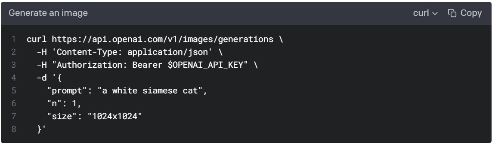
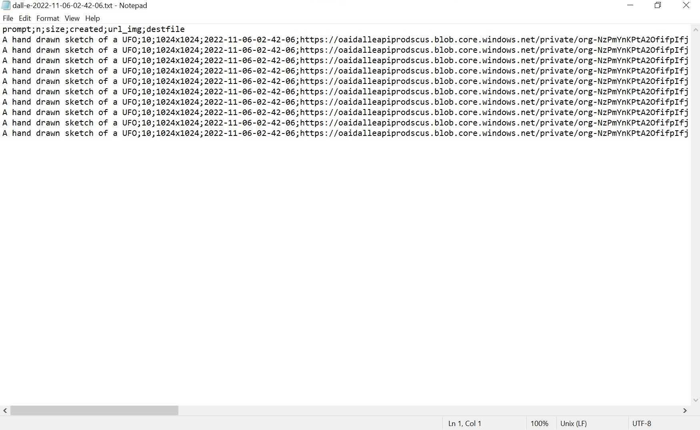

```{r setup, include=FALSE}
knitr::opts_chunk$set(collapse = TRUE)
```

```{r, echo=FALSE}
source("secret.R")
```

# Intro

The previous [blog post](https://www.youcanbeapirate.com/2021/08/15/anonymizing-data-and-creating-fake-data-localize-it/) came out over a year ago! I'm sorry I haven't written here more often, but that's about to change. While I haven't been as active on this site, I've been more active on [LinkedIn](https://www.linkedin.com/in/anttirask/) and [GitHub](https://github.com/AnttiRask/). That has now sparked the need to write in a longer format again.

Anyway, let's get on with it! I promised in the last post to write about APIs next, didn't I? And that's what I'm going to do here. It's a different API than what I had in mind back then, but this one's pretty exciting too!

I've recently gotten more into AI-generated art. I'm no expert, of course, but I've tried the free version of DALL-E 2, created by OpenAI. I had used it online, on my phone, but when I saw ["DALL-E API Now Available in Public Beta"](https://openai.com/blog/dall-e-api-now-available-in-public-beta/) I knew I had to try it.

So, what are we doing here? The object here is to learn

* how to create an API request
* what to do with the content returned by this particular API request
* how to download and save many files using a for loop
* how to create a text file to save all the metadata from that API request

And the most important question is, why are we doing this? I can only speak for myself, but I find AI-generated art fascinating. And to be able to tap into that source of creativity like this is my driver here.

I'll show you one example before we start. DALL-E 2 created this next image using the following text prompt as input:

> "Living on the edge"


Now, I'm not going to go into the art of coming up with a good prompt in any more detail, but there are a lot of examples online and here's [one of them](https://mpost.io/top-50-text-to-image-prompts-for-ai-art-generators-midjourney-and-dall-e/).

## 1. Let's get ready

The original [documentation](https://beta.openai.com/docs/guides/images) is written for only [Python](https://www.python.org/), [Node.js](https://nodejs.org/en/), and [cURL](https://curl.se/). Now, that doesn't have to be a problem. You have to be a little creative, that's all. In fact, the cURL one contains all the necessary information.

{width=100%}

### Let's first go through the cURL code, line by line:

1. Here we have our URL: https://api.openai.com/v1/images/generations.
2. Content type is [json](https://www.json.org/json-en.html). __-H__ indicates it's for the header. But there's actually an __encode__ parameter in __{httr}__'s _POST()_ function. We will insert this information there instead.
3. Authorization is something we will need to put into a header. Also, there's that __$OPENAI_API_KEY__ part. We'll get back to it.
4. __-d__ is indicating that the following is the body of the request:
5. __Prompt__ is the text prompt we will need to change to get the image we want
6. __N__ is the number of images that DALL-E 2 will produce with one API call
7. __Size__ is the pixel size of the image. We'll get back to it in more detail, but it's good to realize already that it will affect the price.

### About pricing

It's also good to start talking about money already. OpenAIs API isn't free to use. You can see the pricing below but should check the most recent prices [here](https://openai.com/api/pricing/). <br>
<br>

```{r pricing, echo=FALSE, message=FALSE, warning=FALSE}
library(tidyverse)
library(gt)

tribble(
~Resolution, ~Price,
"1024×1024", "$0.020 / image",
"512×512",   "$0.018 / image",
"256×256",   "$0.016 / image"
) %>%
    gt() %>% 
    tab_header(
        title    = "Image models",
        subtitle = "on 2022-11-20"
    )
```

<br>

There are also language models that are available (with a different pricing structure). But that is a topic for another blog post another time.

### About the different cURL R packages

One last thing before we start. Even if the cURL code inspired us, we don't have to use the cURL packages for R to use the API. And there are at least two of those that I know of: [{RCurl}](https://cran.r-project.org/web/packages/RCurl/index.html) and [{curl}](https://cran.r-project.org/web/packages/curl/index.html). But since [{httr}](https://httr.r-lib.org/) by Hadley Wickham is more intuitive to use, we'll stick to that one.

## 2. Signing up to get the OpenAI API key

Right, I won't go through this part of the process in any great detail. But you do need to sign up to [OpenAI](https://beta.openai.com/signup/) to be able to use the API. Sign up and give your credit card information. At the moment of writing you get "$18 in free credit that you can use during your first 3 months", though. Use it wisely and also set up a limit you're comfortable using per month!

After you have signed up, you need to get your OpenAI API key. You know, the one that will replace __$OPENAI_API_KEY__ in our upcoming code. Once you have signed up and signed in, go to __Personal__ > __View API Keys__ and tap __+ Create new secret key__. Copy the key and store it using something like [this](https://www.geeksforgeeks.org/managing-secrets-and-auth-details-in-r-language/).

## 3. Loading the libraries

Let's load the necessary packages. And as you can see, I use the terms packages and libraries interchangeably. If you don't have one or more of them, install them first with the _install.packages()_ function.

```{r libraries, message=FALSE, warning=FALSE}
library(httr)       # for making the API request
library(tidyverse)  # for everything else
library(lubridate)  # for manipulating the time stamp
```

## 4. Let's create the API request with __httr__

### Let's start with the arguments

Let's go through them in the same order as they were in the documentation. We are skipping lines 4 and 8, though, as they don't contain any important information. As you can see, it's about recognizing the elements and writing them in the format that __httr__ uses. When doing something like this, read the [documentation](https://httr.r-lib.org/), try things out and see what works (and what doesn't).

Now, it's important you use that API key you received. Switch it with that __$OPENAI_API_KEY__. Again, if you are going to use GitHub, you can store it and use it using something like [this](https://www.geeksforgeeks.org/managing-secrets-and-auth-details-in-r-language/). There's a [GitHub repo](https://github.com/AnttiRask/how_to_insert_topic_here_with_R/tree/main/how_to_use_an_api_with_R) I've made that gives you a better idea of what a finished working script looks like.

```{r arguments}
# 1. curl https://api.openai.com/v1/images/generations \
url_api       <- "https://api.openai.com/v1/images/generations"

# 2. -H 'Content-Type: application/json' \
encode        <- "json"

# 3. -H "Authorization: Bearer $OPENAI_API_KEY" \
authorization <- "Bearer $OPENAI_API_KEY"

# 5. "prompt": "a white siamese cat",
prompt        <- "A hand drawn sketch of a UFO"

# 6. "n": 1,
n             <- 1

# 7. "size": "1024x1024"
size          <- "1024x1024"
```

### Let's then create the request

First, gather the arguments as the body of the request:

```{r body}
body <- list(
    prompt = prompt,
    n      = n,
    size   = size
)

body
```

We can see that the arguments are working as they should. And now they are in the list format.

Then, the request itself:

```{r, echo=FALSE}
authorization <- str_glue("Bearer {OPENAI_API_KEY}")
```


```{r request}
request <- POST(
    url    = url_api,
    add_headers(Authorization = authorization),
    body   = body,
    encode = encode
)

request
```

With that POST request, we get as many images (or URLs for those images, to be exact) as we chose earlier. This is also the part of the script that requires payment.

### Finally, let's take a look at the content

```{r content}
request %>%
    content() %>%
    glimpse()
```

That _content()_ function from __{httr}__ converts the data from the _json_ format that it arrived in into a list with two elements: __created__ (time stamp in seconds) and __data__ (url(s)). Next we'll take these individual elements as they will help us get those images. So far we only have text data!

## 5. Saving the individual elements

### Time stamp (created)

The idea here is to use the contents we saw to take the next necessary steps. Let's first take that created value (time of creation). Turn it into an [date-time](https://r4ds.hadley.nz/datetimes.html#from-other-types) object. Then turn it into a string, so that we can use it as the basis for the __filename__ when we get there.

```{r}
created <- request %>%
    content() %>%

    # We take the first element 'created' of the content (in the list format)
    pluck(1) %>%

    # Then use {lubridate} to turn that number into a datetime object.
    # We have to provide a timezone. You can see the list using this function:
    # OlsonNames(). Mine happens to be "Europe/Helsinki"
    as_datetime(tz = "Europe/Helsinki") %>%
    ymd_hms() %>%

    # Finally, let's turn the datetime object to a string and replace the
    # spaces and colons with dashes, so that the filename will be cleaner
    as.character() %>%
    str_replace_all("\\s", "-") %>%
    str_replace_all("\\:", "-")

created
```

### URL(s)

Next, let's pluck the URL(s) from the requested _content_ and make it/them a vector. We will use that vector to next download the image(s) from the temporary address the API has saved them.

> The URL(s) will expire in an hour! So you should run the script from start to finish when you're ready. And in case you don't know how it's done, the easiest way to do it is to press Ctrl + Alt + R.

```{r}
url_img <- request %>%
    content() %>%
    pluck(2) %>%
    unlist() %>%
    as.vector()

url_img
```

## 6. Downloading the images

We'll be using a [for loop](https://r4ds.hadley.nz/base-r#for-loops) to go through each of the URLs contained in the vector _url_img_ we created.

Most of the packages we've been using so far have been from the __{tidyverse}__ family of packages. But for this part we'll be using base R functions: _for loop_, _seq_along_, _paste0_ and _download.file_. I'm quite certain there is a 'tidy' way to do this with __{purrr}__ & co. but the following was the easiest/fastest way to the goal. You can always go back and update the code once it's working.

The code has are three parts:

1. __for (i in seq_along(url_img))__ sets up the for loop. You can read this in English: "For each URL found in the url_img vector run these following two parts".
2. Create the filename. We use the character string __"dall-e"__, the __creation time stamp__, __"-"__, and a running number at the end. The __i__ means index. <br>
For example: "dall-e-2022-11-05-22-16-12-1.png"
3. Download the files mentioned in the __url_img__. __Mode = "wb"__, because we're downloading binary files. Won't work without it. Believe me, I've tried.

```{r}
for (i in seq_along(url_img)) {

    destfile <- c(
        paste0(
            "images/dall-e-",
            created,
            "-",
            i,
            ".png"
        )
    )

    download.file(url_img[i], destfile, mode = "wb")
    
}
```

And voilà!


## 7. Writing the metadata in a .txt file

### Gather the metadata

In case you want to know how DALL-E 2 created a particular image (using which prompt etc.) or wish to use the
URL (for an hour, remember it's gone after that), we'll gather all the info first.

```{r}
metadata <- tibble(
    prompt,
    n,
    size,
    created,
    url_img,
    destfile
)
```

### Create the path/filename

We'll use one file for the image metadata (whether there are one or more images). And by using a similar naming convention, you can find everything without trouble.

```{r, eval=FALSE}
file <- str_glue("images/dall-e-{created}.txt")
```

### Write the .txt file

As you can see, with _tibble_ and _str_glue_ we returned to the __{tidyverse}__. We'll wrap things up with _write_delim_, a lesser-known function from the _{readr}_ packages _write__ family of functions.

I chose a .txt file for ease of use, but with the delimiters, it's still easy enough to read in in a tabular format.

```{r, eval=FALSE}
metadata %>%
    write_delim(
        file  = file,
        delim = ";"
    )
```

### The end result

And this is what it then looks like:



## 8. Conclusion

I guess it's better not to make any grand promises since it took a year to fulfill the previous one.

But I hope you had fun with this one. And I hope you have a good time using {httr} for OpenAI API or something completely different!

I'm not promising anything, but I will probably be checking out the other APIs by OpenAI at some point. I'll let you know if/when I do!

And just to remind you, if you wish to have a functioning R script and don't want to build it piece by piece, you can find it on my [GitHub](https://github.com/AnttiRask/how_to_insert_topic_here_with_R/tree/main/how_to_use_an_api_with_R).

Cheers!